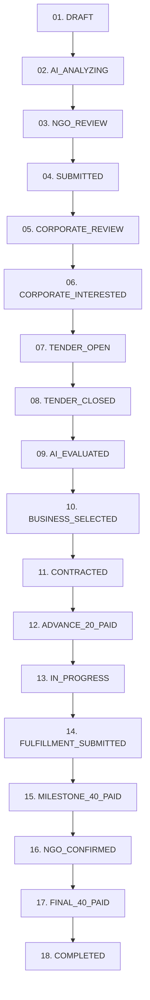

# IRISiv — Verified CSR Procurement & Verifiable Impact Platform

> **Powered by Featherless AI & Deterministic 20/40/40 Milestone Escrow**

IRISiv is an end-to-end Corporate Social Responsibility (CSR) procurement and impact verification platform that connects **NGOs**, **Corporates**, and **Business Vendors** into a single transparent, tamper-proof lifecycle.

---

## 🌟 Key Features & Problem Solved

Traditional CSR funding suffers from **opacity, inflated vendor costs, fake beneficiary metrics, and delayed milestone payments**. IRISiv eliminates these challenges through:

1. **Natural Language NGO Need Structuring (Featherless AI):**
   NGOs describe community needs in plain language. Featherless AI converts descriptions into structured CSR specifications with required item counts, budget estimates, urgency ratings, and Schedule VII eligibility indicators.

2. **Blind Procurement Tenders & 7-Factor AI Quotation Scoring:**
   Corporates create blind tenders. Businesses submit competitive quotations. Featherless AI evaluates every bid across **7 weighted metrics** (Price 15%, Spec Match 25%, Timeline 15%, Capacity 20%, Experience 15%, Feasibility 10%, Verification 100%) and provides a side-by-side comparison table.

3. **Strict 20 / 40 / 40 Milestone Payment Architecture:**
   - **20% Advance Payment**: Recorded upon contract execution so vendors can begin work immediately.
   - **40% Fulfillment Milestone Payment**: Recorded when the vendor submits proof of delivery/service evidence.
   - **40% Final Payment**: Released only after the NGO physically inspects receipt on the ground and Featherless AI cross-validates.

4. **Dual-Layer Physical + AI Verification:**
   Combines real-world physical ground verification by authorized NGO representatives with AI image/document cross-validation to detect quantity mismatches or quality defects.

5. **Verifiable Impact Reports:**
   Automated generation of audit-ready impact reports with beneficiary metrics, proof photos, and financial ledger data for corporate annual CSR reporting.

---

## 🔄 End-to-End 18-Step CSR State Machine

Every project on IRISiv moves through a deterministic 18-state lifecycle graph:



---

## 🏛️ Portal Architecture & User Roles

| Role | Key Capabilities & Features |
| :--- | :--- |
| **NGO Partner** | Submit community requirements, review AI Need Structuring reports, conduct physical ground checks, submit verification checklists, and access verifiable impact reports. |
| **Corporate Sponsor** | Review NGO needs, publish CSR procurement tenders, compare side-by-side AI-scored quotations, select vendors, authorize 20/40/40 milestone disbursements, and export audit trails. |
| **Business Vendor** | Browse open tenders, submit blind quotations with pricing and capacity, manage active execution, and upload fulfillment evidence documents (receipts, LR notes, photos, invoices). |
| **Admin Governance** | Global project state machine monitor, system-wide audit trail ledger, AI health check, and one-click demo state reset control. |

---

## 💳 The 20 / 40 / 40 Payment Model Explained

| Milestone | % | Trigger Condition | Outcome |
| :--- | :---: | :--- | :--- |
| **1. Advance Payment** | `20%` | Contract signed & executed between Corporate and Business Vendor | Capital disbursed to business vendor so procurement/manufacturing can start immediately. |
| **2. Fulfillment Milestone** | `40%` | Vendor submits delivery receipt, LR note, logistics proof, or service execution report | Milestone recorded; NGO notified to perform physical ground verification. |
| **3. Final Payment** | `40%` | NGO physically inspects goods/services on-site + Featherless AI cross-validates | Final funds released to vendor; verifiable impact certificate and audit report generated. |

---

## 🤖 Featherless AI Model Specifications

- **Model Used:** `Qwen/Qwen2.5-72B-Instruct` via Featherless AI API
- **AI Need Analyzer:** Converts natural language NGO inputs into structured CSR JSON objects.
- **Quotation Evaluator:** 7-score weighted matrix generating objective vendor recommendations.
- **Fulfillment Validator:** Cross-checks NGO physical receipt counts against vendor delivery documents to detect shortfalls.
- **Impact Generator:** Synthesizes verified beneficiary numbers and payment milestone data into an executive summary.
- **Platform AI Assistant:** Role-aware chatbot embedded across all pages.

---

## 🛠️ Technology Stack

- **Framework:** Next.js 15 (App Router, React 19)
- **Language:** TypeScript
- **Styling:** Tailwind CSS (Vanilla Light Mode palette)
- **Database / Backend:** Supabase (PostgreSQL) + In-Memory Failover Store
- **AI Layer:** Featherless AI Inference Adapter
- **Icons & UI Components:** Lucide React, Framer Motion

---

## 🚀 Getting Started Locally

### 1. Prerequisites
- Node.js 18+ or 20+
- npm or yarn

### 2. Installation
```bash
# Clone the repository
git clone https://github.com/dare-devil-coder/IRISiv.git
cd IRISiv

# Install dependencies
npm install
```

### 3. Environment Setup
Create a `.env.local` file in the root directory:
```env
NEXT_PUBLIC_SUPABASE_URL=your_supabase_url
NEXT_PUBLIC_SUPABASE_ANON_KEY=your_supabase_anon_key
FEATHERLESS_API_KEY=your_featherless_api_key
FEATHERLESS_BASE_URL=https://api.featherless.ai/v1
FEATHERLESS_MODEL=Qwen/Qwen2.5-72B-Instruct
```

### 4. Running the Development Server
```bash
npm run dev
```
Open [http://localhost:3000](http://localhost:3000) in your browser.

---

## 📜 Production Build Verification

To run a full production build:
```bash
npm run build
```
All 25 static and dynamic pages compile cleanly with 0 errors.

---

## 👥 Hackathon Team & Acknowledgments

Built for the **IRIS IV Hackathon**. Designed and developed with a focus on trust, transparency, and real-world CSR impact verification.
